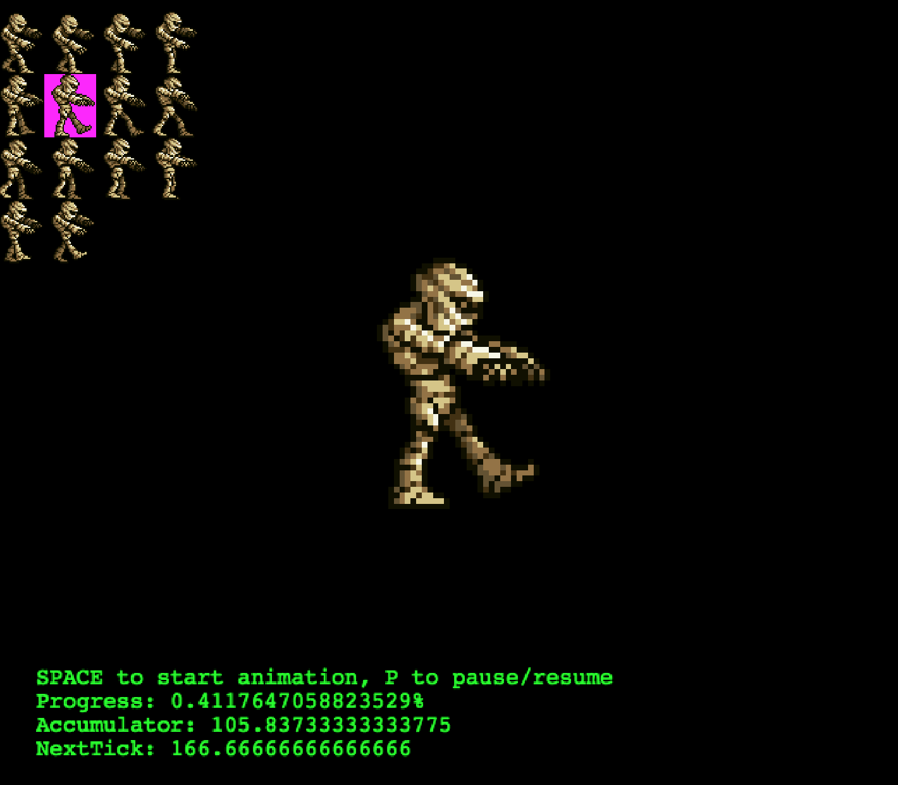

# Animations

This contains details of all the examples in the animations folder. You can find the source code for these in `src/examples/animations/`.

## Tween.js

This example shows you how to load an image and create a tween on that image. Watch as the logo bounces up and down in the window.

## Data.js

In this example you'll load a sprite sheet image and then cycle through the images in the sheet to create a working animation. This also shows you how to play and pause animations and restart animations.

## Add.js

This example adds a new animation on each time you click using the animation event listeners. It also shows you how to load an atlas of animation data from a JSON fie.
